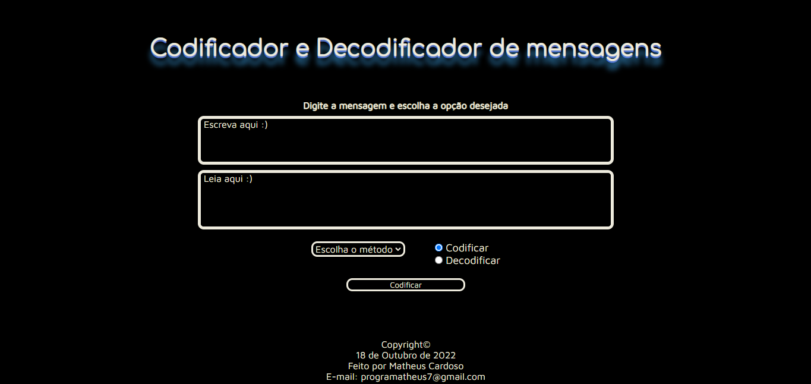
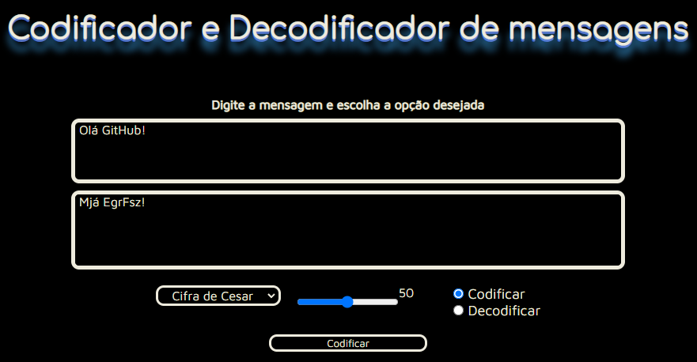
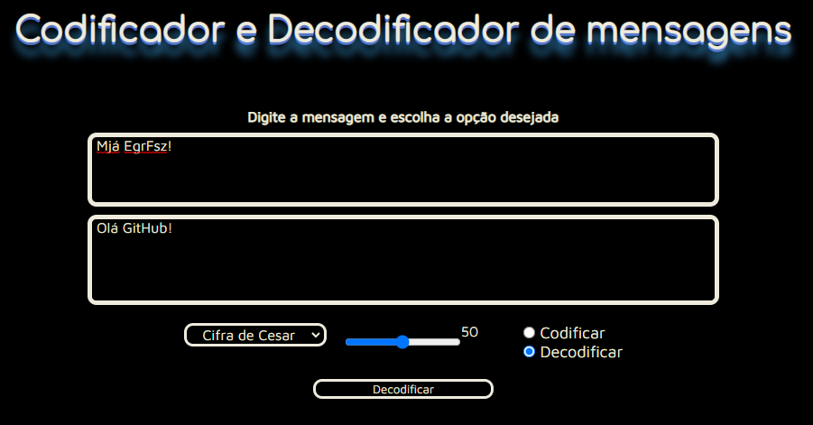

<h1  align="center"> :desktop_computer: Codificador de Texto  </h1>

<h2> 	:arrow_right: Descrição da Página </h2>

Segundo projeto individual do curso de desenvolvimento web do Programadores Cariocas. O objetivo era criar um site que codificasse e decodificasse textos em Cifra de César e Base64.

O projeto é em página única. Possui um campo para digitação (podendo incluir maiúsculas e caracteres especiais) e outro para leitura onde o texto escrito é codificado ou decodificado. Abaixo dos campos para escrita e leitura, há a disponibilidade para escolha do tipo de código e botão para acionar o que o usuário desejar. Caso opte pela Cifra de César há também a opção de escolha de rotação da cifra. Há também um pequeno aviso em alerta colorido caso o usuário esqueça de selecionar um dos métodos.

 

<strong> :white_check_mark: Texto codificado em Cifra de César (rotação 50)</strong>

 

<strong> :white_check_mark: Texto decodificado em Cifra de César (rotação 50)</strong>

<h2> :desktop_computer: Tecnologias Utilizadas </h2>

<ul>
<li>HTML: Criação da estrutura da página com classes, id e comentários para melhor organização do código; </li>
<li>CSS: Estilização de toda a página utilizando conteúdo aprendido para deixar a página mais interessante e interativa para o usuário; </li>
<li>Javascript: Implementação e funcionalidade das criptografias (Cifra de César e Base64) colocando em prática o que aprendemos sobre DOM, conceitos de lógica, funções e manipulação de arrays.</li>
</ul>
